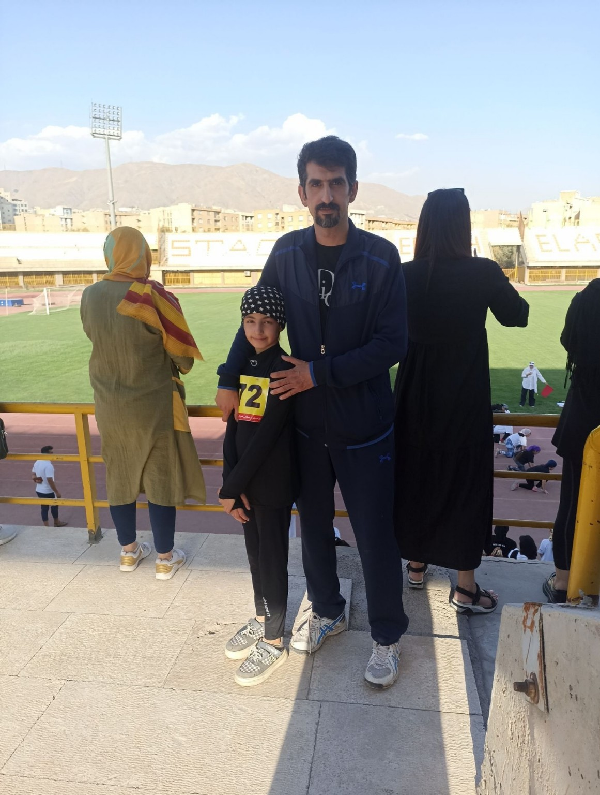
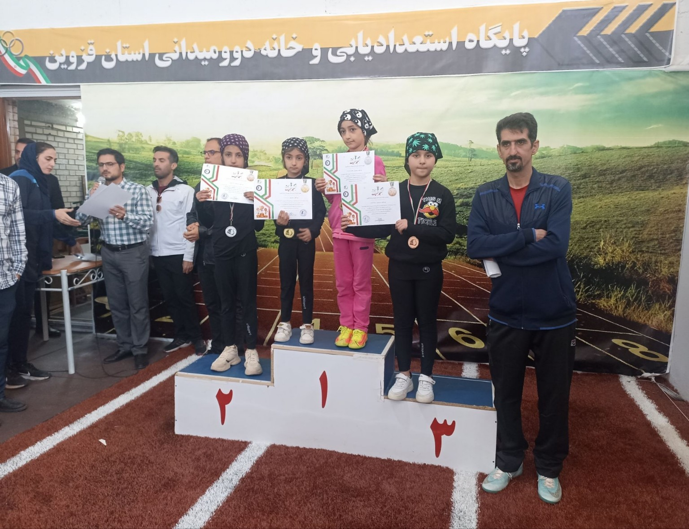
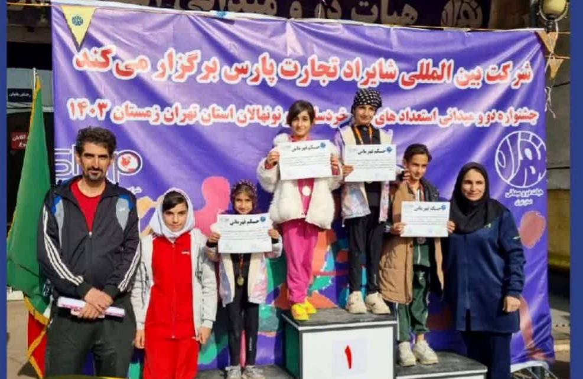

<!DOCTYPE html>
<html lang="fa">
<head>
  <meta charset="UTF-8">
  <meta name="viewport" content="width=device-width, initial-scale=1.0">
  <title>مهدی معدنی‌پور | مربی و داور</title>
  
</head>
<body>
  <header>
    
    <h1>مهدی معدنی‌پور</h1>
    
مربی و داور دوومیدانی – رده سنی نونهالان

    <a class="whatsapp-btn" href="https://wa.me/989371523331" target="_blank">ارتباط با من در واتساپ</a>
  </header>
  

    <h2>درباره من</h2>
    

      مربیگری دوومیدانی نونهالان در پیست شهدای نظرآباد، استان البرز. با سابقه داوری، تمرکز من بر آموزش علمی و پرورش اخلاق ورزشی در کودکان است.
      شاگردانم تاکنون در چندین رقابت استانی موفق به کسب مقام شده‌اند.
    

    <h2>محل فعالیت</h2>
    
استان البرز - شهر نظرآباد - پیست دوومیدانی شهدا

    <h2>مدارک و سوابق</h2>
    <ul>
      <li>مربی دوومیدانی نونهالان</li>
      <li>داور مسابقات دوومیدانی</li>
      <li>تجربه در استعدادیابی و آموزش اصولی دوی سرعت</li>
    </ul>

    <h2>افتخارات شاگردان</h2>
    <ul>
      <li>مسابقات لیگ دوومیدانی نونهالان استان قزوین در ماده‌های دو ۶۰ متر، ۲۰۰ متر و پرش طول: مجموع ۲ طلا، ۱ نقره و ۱ برنز</li>
      <li>جشنواره استعدادیابی دو و میدانی نونهالان استان تهران (زمستان ۱۴۰۳): مجموع ۳ طلا و ۱ برنز</li>
    </ul>

    

      
      
    

    <h2>تماس با من</h2>
    <form>
      <label>نام و نام خانوادگی:</label>
      <input type="text" placeholder="نام شما">
      <label>شماره تماس:</label>
      <input type="text" placeholder="مثلاً 09123456789">
      <label>پیام:</label>
      <textarea rows="5" placeholder="متن پیام شما..."></textarea>
      <input type="submit" value="ارسال">
    </form>
  

</body>
</html>

